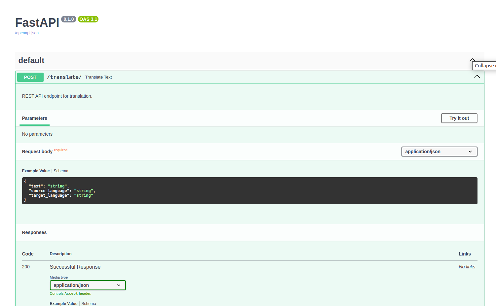
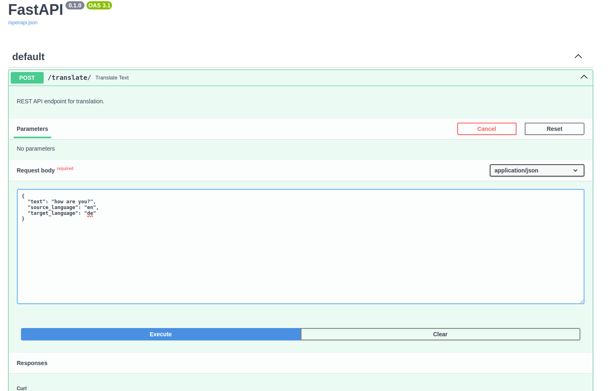

### "Ladder Translation Websocket"  Project

# Ladder Translation: Machine Translation Framework

Ladder Translation is a machine translation framework designed to enhance translation capabilities using a model-agnostic approach. This project includes RESTful and WebSocket APIs for seamless integration and real-time processing.

---

## Features

1. **REST API Endpoint**  
   - **URL:** `/translate/` (POST)  
   - **Parameters:**  
     - `text`: Text to translate (string).  
     - `source`: Source language code (string).  
     - `target`: Target language code (string).  
   - **Description:**  
     Accepts input text and language parameters. It uses the `generate_translation` function to produce the translation and returns a JSON response.  

   **Example Request:**  
   ```json
   {
     "text": "Hello, world!",
     "source": "en",
     "target": "fr"
   }
   ```

   **Example Response:**  
   ```json
   {
     "translation": "Bonjour, le monde!"
   }
   ```

2. **WebSocket Endpoint**  
   - **URL:** `/ws/translate`  
   - **Description:**  
     Supports real-time translation by processing incoming text and returning translations directly via WebSocket.  

   **How it Works:**  
     - Connect to the WebSocket endpoint.
     - Send data containing the text, source, and target language.
     - Receive the translated result instantly.

---

## Running the Backend

1. Start the backend server using FastAPI.
2. Access the FastAPI auto-generated documentation at `/docs` for REST API and WebSocket usage.

---

## Screenshot of Backend

Include a screenshot demonstrating the server running with FastAPI and showcasing the documentation for both REST and WebSocket endpoints. Save the screenshot as **"hasil backend Machine Translation using Ladder with WebSocket"**.


---

## Installation and Usage

1. Clone the repository.  
   ```bash
   git clone https://github.com/khairililmi2468gmailcom/apiwebsocket_ladder.git
   cd apiwebsocket_ladder
   ```

2. Install dependencies.  
   ```bash
   pip install -r requirements.txt
   ```

3. Run the server.  
   ```bash
   python3 -m uvicorn main:app --host 0.0.0.0 --port 9001
   ```

4. Access the API documentation at `http://127.0.0.1:9001/docs`.

---
